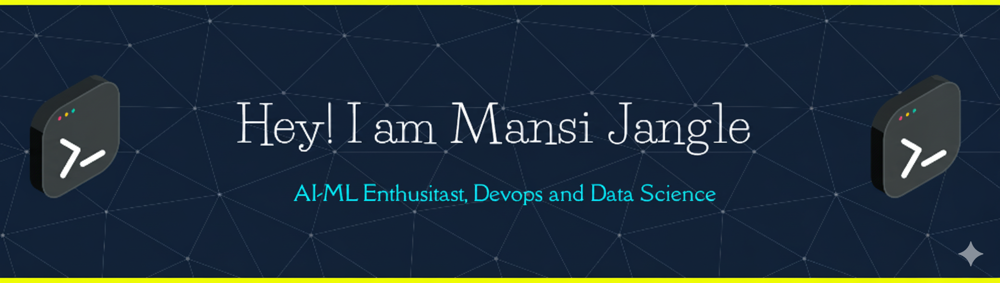

  

### 🚀 Projects I'm Proud Of
-**🤖 AI-Powered Career Guidance Chatbot**
  - Engineered an intelligent advisory system using Flask, HuggingFace & NLTK, enabling real-time analysis of user queries and PDF documents 💬.
  - Integrated pretrained NLP models for semantic context extraction, delivering personalized and domain-specific career recommendations 📄.
  - Deployed on a lightweight Flask server with dynamic routing and stateful query handling, ensuring smooth and context-aware interactions ⚡

-**🧠 Smart Tab Manager — Chrome Extension**  
  - Developed a high-efficiency Chrome extension using JavaScript & Manifest V3, implementing a custom LFU caching mechanism to auto-close rarely used tabs 🧩.
  - Leveraged Chrome Tabs API & Storage API to monitor, score, and manage open tabs in real time ⚡.
  - Integrated a popup UI & background worker for seamless control, improving resource utilization and reducing browser memory consumption by 40%+ 📉.

  

### 📊 GitHub Stats

  </img>

  </img>
  </img>

  </img>

  

## 🏅 My LeetCode Badges

### 🎯 2025 Streak Badges
  

### 🎯 2024 Streak Badges
  

  

### Tech Stack

  

### 🚀 Projects I'm Proud Of
-**🤖 AI-Powered Career Guidance Chatbot**
  - Engineered an intelligent advisory system using Flask, HuggingFace & NLTK, enabling real-time analysis of user queries and PDF documents 💬.
  - Integrated pretrained NLP models for semantic context extraction, delivering personalized and domain-specific career recommendations 📄.
  - Deployed on a lightweight Flask server with dynamic routing and stateful query handling, ensuring smooth and context-aware interactions ⚡

-**🧠 Smart Tab Manager — Chrome Extension**  
  - Developed a high-efficiency Chrome extension using JavaScript & Manifest V3, implementing a custom LFU caching mechanism to auto-close rarely used tabs 🧩.
  - Leveraged Chrome Tabs API & Storage API to monitor, score, and manage open tabs in real time ⚡.
  - Integrated a popup UI & background worker for seamless control, improving resource utilization and reducing browser memory consumption by 40%+ 📉.

  

### 📊 GitHub Stats

  </img>

  </img>
  </img>

  </img>

  

## 🏅 My LeetCode Badges

### 🎯 2025 Streak Badges
  

### 🎯 2024 Streak Badges
  

  

### Tech Stack

  

### 📚 I'm Into

- 🤖 Deep Learning & AI applications  
- 🤖 Automation tools & smart assistants  
- 🏗️ Scalable backend systems  
- 🧹 Clean code & software design

  

### 🏆 Achievements

- 💻 800+ DSA problems solved   
- 🥈 Gold Medal for Academic Excellence in IT Department
- 🎓 CGPA: **9.25**

  

### 🔗 Let's Connect

    
   
  
  
  

  

Thanks for visiting! Feel free to ⭐ one of my projects or reach out for collaboration! 🙌

<!--
**mansijangle/mansijangle** is a ✨ _special_ ✨ repository because its `README.md` (this file) appears on your GitHub profile.

Here are some ideas to get you started:

- 🔭 I’m currently working on ...
- 🌱 I’m currently learning ...
- 👯 I’m looking to collaborate on ...
- 🤔 I’m looking for help with ...
- 💬 Ask me about ...
- 📫 How to reach me: ...
- 😄 Pronouns: ...
- ⚡ Fun fact: ...
-->

  

### 📚 I'm Into

- 🤖 Deep Learning & AI applications  
- 🤖 Automation tools & smart assistants  
- 🏗️ Scalable backend systems  
- 🧹 Clean code & software design

  

### 🏆 Achievements

- 💻 800+ DSA problems solved   
- 🥈 Gold Medal for Academic Excellence in IT Department
- 🎓 CGPA: **9.25**

  

### 🔗 Let's Connect

    
   
  
  
  

  

Thanks for visiting! Feel free to ⭐ one of my projects or reach out for collaboration! 🙌

<!--
**mansijangle/mansijangle** is a ✨ _special_ ✨ repository because its `README.md` (this file) appears on your GitHub profile.

Here are some ideas to get you started:

- 🔭 I’m currently working on ...
- 🌱 I’m currently learning ...
- 👯 I’m looking to collaborate on ...
- 🤔 I’m looking for help with ...
- 💬 Ask me about ...
- 📫 How to reach me: ...
- 😄 Pronouns: ...
- ⚡ Fun fact: ...
-->
